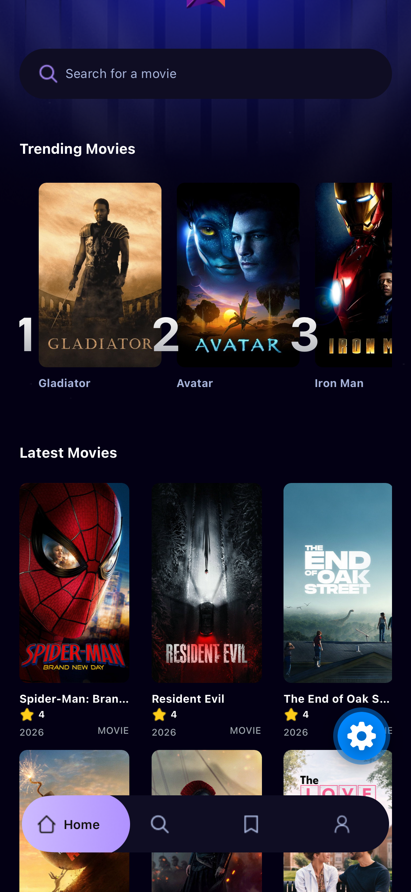

# 🎬 Mobile Movie App

hi! this is my movie app that I made with **React Native + Expo** 📱 it's basically a mini movie browser where you can find movies, see what's trending, and save the ones you want to watch later (so you stop forgetting what your friend told you to watch lol)

<p align="center">
  
</p>

## ✨ what it can do

- 🔥 **Trending Movies**: shows the top movies people search the most in the app (ranked 1, 2, 3...)
- 🆕 **Latest Movies**: a grid of popular movies from TMDB with rating, year, and poster
- 🔍 **Search**: type a movie name and it finds it for you
- 🎞️ **Movie details**: tap a movie to see the overview, rating, runtime, genres, etc.
- 🔖 **Save movies**: you can save movies to your own Saved list (you need an account for this)
- 👤 **Sign up / Sign in / Profile**: make an account, see how many movies you saved, and sign out
- 👻 if you're not signed in and tap Save, it asks you to sign in first and then brings you back to the movie. took me a while to get that one right haha

## 🛠️ built with

- [Expo](https://expo.dev) + [Expo Router](https://docs.expo.dev/router/introduction) (file-based routing, super nice)
- React Native + TypeScript
- [NativeWind](https://www.nativewind.dev) (Tailwind but for React Native 💅)
- [TMDB API](https://www.themoviedb.org) for all the movie data
- [Appwrite](https://appwrite.io) for accounts, the saved list, and tracking trending searches
- Jest for testing

## 🚀 how to run it

1. clone the repo and install stuff

   ```bash
   npm install
   ```

2. set up your API keys. copy `.env.example` to `.env` and fill it in. (**please don't commit your `.env`** 🙏)
   - **TMDB**: get the "API Read Access Token" (the long one that starts with `eyJ`) from your [TMDB settings](https://www.themoviedb.org/settings/api)
   - **Appwrite**: make a project, add Expo Go (`host.exp.exponent`) as an Android/iOS platform, turn on Email/Password auth, and make a database with two collections:
     - `metrics` (for trending): `searchTerm` string, `movie_id` int, `title` string, `count` int, `poster_url` url. give it a unique index on `searchTerm` and let the **Any** role Read/Create/Update
     - `saved_movies`: `member_id` string, `movie_id` int, `title` string, `poster_url` url, `release_year` int, `rating` float. turn on document security, let **Users** Create only, and add a unique index on `member_id` + `movie_id`

3. start the app!

   ```bash
   npx expo start
   ```

   then open it with Expo Go on your phone or an iOS/Android simulator.

## 🧪 tests and checks

```bash
npm test            # run the tests
npx tsc --noEmit    # typescript check
npx expo lint       # lint
```

## 📂 folder stuff

```
app/          screens (tabs, movie details, sign in/up)
components/   reusable UI pieces
services/     TMDB + Appwrite API calls
interfaces/   types
constants/    icons, images, etc.
__tests__/    tests
```

## 🙌 credits

- movie data from [TMDB](https://www.themoviedb.org) (this product uses the TMDB API but is not endorsed or certified by TMDB)
- inspired by a bunch of React Native tutorials on YouTube, thank you to all of them ❤️

---

made with ☕ and a lot of late nights
